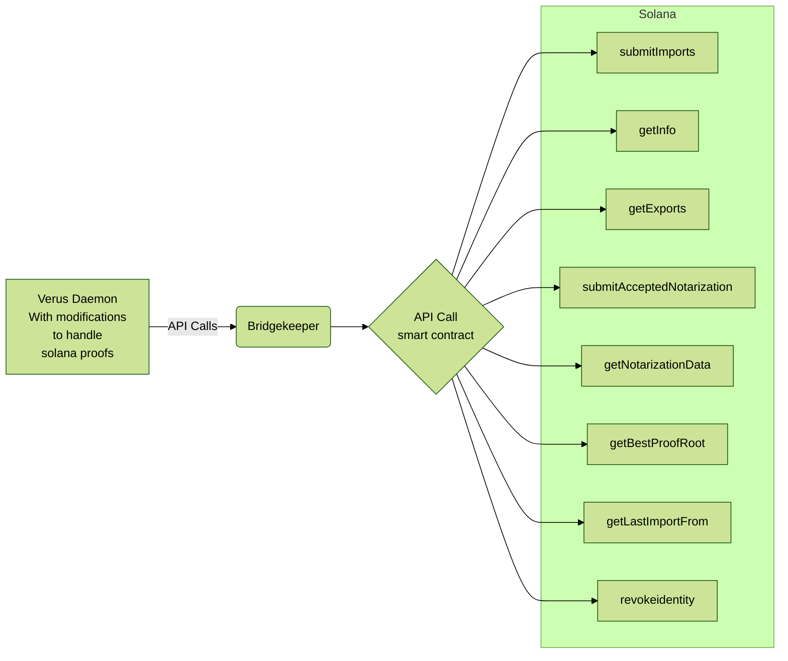

# [!badge variant="info" icon="/solana-sol-logo.svg" iconAlign="right" text="Solana Bridge Project"] 

:icon-arrow-right: [!badge variant="dark" icon="/discord-icon.svg" text="Announcement"](https://discord.com/channels/1180350488256987177/1180568601707679815/1217815011695530055) by [!badge variant="dark" icon="/bishop.png" text="Bishop9773"](https://discord.com/channels/1180350488256987177/1180568601707679815/1217815011695530055)

#### Project synopsis

{.list-icon}
- [ ]: 1. Rust RPC Server
    - [ ] 1.1 Handle API calls from the Verus Daemon
    - [ ] 1.2 Serialize and deserialize data
    - [ ] 1.3 Interact with Solana smart contract endpoints               
    - [ ] 1.4 Host a wallet to pay for Solana state change transactions
    - [ ] 1.5 Solana utility functions for Notarizers
- [ ] 2. Solana Smart Contracts
- [ ] 3. Daemon modification to accept Solana Proofs
- [ ] 4. Website so interact with Smart contract
- [ ] 5. Mobile app to interact with Solana and Verus 

#### Resources

:icon-arrow-right: [!badge variant="dark" icon="/verus-icon-white.svg" text="Verus Daemon"](https://github.com/VerusCoin/VerusCoin)

:icon-arrow-right: [!badge variant="dark" icon="/verus-icon-white.svg" text="Verus Ethereum Contracts"](https://github.com/VerusCoin/Verus-Ethereum-Contracts)

:icon-arrow-right: [!badge variant="dark" icon="/verus-icon-white.svg" text="Verus Bridgekeeper"](https://github.com/VerusCoin/Verusbridgekeeper)

:icon-arrow-right: [!badge variant="dark" icon="/verus-icon-white.svg" text="Verus Ethereum Website"](https://github.com/VerusCoin/VerusBridgeWebsite)

:icon-arrow-right: [!badge variant="dark" icon="/verus-icon-white.svg" text="Verus Mobile App"](https://github.com/VerusCoin/Verus-Mobile)

:icon-arrow-right: [!badge variant="dark" icon="/verus-icon-white.svg" text="Verus TS Resources"](https://github.com/VerusCoin/verus-typescript-primitives)

#### People Attempting Bounty

@.........

#### Milestones
MVP 1
:   Define What needs to be built
    - In the Daemon
    - Define and choose programming language to be used for each module
    - Smart Contracts
    - Apps

MVP 2.1
:   Create serializing libraries

MVP 2.2
:   Create RPC API for DAemon to connect to